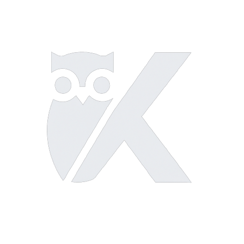

<div align='center'> 
  
</div>

# KafkaNightOwl

### Kafka NightOwl is an open-source project dedicated to developing a powerful Kafka cluster visualization tool specifically designed for senior software developers. Our mission is to empower developers with a simple yet powerful tool that allows them to monitor and visualize their Kafka clusters effortlessly and get live time alerts which enable developers to effectively troubleshoot, optimize performance, and efficiently manage their Kafka clusters.

# Features at a Glance

Real-time Metrics and Charts: Kafka NightOwl provides you with real-time insights into your Kafka clusters' health and performance through easy-to-understand metrics and visually appealing charts. Gain a deeper understanding of topics, partitions, brokers, and more.

Seamless Prometheus Integration: Setting up Prometheus to scrape Kafka metrics has never been easier. Kafka NightOwl guides you through the process, ensuring that your data collection is a smooth experience.

Intuitive Dashboard: The application's main dashboard serves as your central hub for Kafka cluster monitoring. Our integration of the ChartJS library provides numerous customization features to the dashboard including moving, resizing, and auto-scale and fit.

Alerts and Notifications: Kafka NightOwl leverages Prometheus AlertManager to keep you informed about critical issues. Receive alerts about errors, performance drops, and other anomalies, allowing you to take proactive measures.

# Getting Started with Kafka NightOwl

1. Creating a User Account
   Before diving into Kafka cluster visualization, you'll need to create a user account. Simply sign up with your email and password to access the powerful features of Kafka NightOwl.

2. Connecting to Prometheus
   To kickstart the monitoring process, connect Kafka NightOwl to your Prometheus instance running locally. Our team has provided sample configuration files for Kafka, Prometheus, and AlertManager as well as a simple guide to connect these together.
   

3. Exploring Metrics
   Once connected, Kafka NightOwl provides an intuitive interface to explore various Kafka metrics. Select topics, partitions, or brokers, and watch as the application generates insightful charts and graphs, giving you a real-time view of your cluster's health. Customize your metrics display by dragging and resizing charts and even add more metrics to your dashboard.
   
   

4. Staying Informed with Alerts
   Kafka NightOwl's AlertManager integration empowers you to stay ahead of critical issues. Whenever an anomaly or error is detected, an alert will be triggered. You can acknowledge and manage these alerts directly from the application.
   

# Setup for new Kafka/Prometheus user

1. Setting up Kafka by following Apache Kafka Quickstart tutorial: [Apache Kafka Quickstart](https://kafka.apache.org/quickstart)
2. Configure JMX Exporter for Kafka

- Download the JMX Exporter jar file from: https://github.com/prometheus/jmx_exporter
- Configure the JMX exporter configuration file for Kafka (example configuration files can be found at https://github.com/prometheus/jmx_exporter/tree/main/example_configs)
- CD to your Kafka directory
- Run

```
java -jar jmx_prometheus_httpserver-0.19.0.jar <port number> <exporter-config-file-path>
```

to expose your metrics at https://localhost:[port number]/metrics

- Run

```
export KAFKA_OPTS="-javaagent:/<exporter-jar-file-path>/jmx_prometheus_javaagent-0.19.0.jar=<port number>:/<kafka-yml-file-path>/kafka-2_0_0.yml"
```

- Start your Kafka server

3. Setting up Prometheus by following: [Prometheus Tutorial](https://jhooq.com/prometheous-grafan-setup/)
4. Configure the prometheus.yml file as shown in /setup/prometheus
5. Download and Setup AlertManager from [Prometheus](https://prometheus.io/download/)
6. Configure the alertManager.yml file as shown in /setup/prometheus

# Tech Stack

<div align='center'>


</div>

# Contributors

|  Developed By  |                                                                       Github                                                                       |                                                                           LinkedIn                                                                            |
| :------------: | :------------------------------------------------------------------------------------------------------------------------------------------------: | :-----------------------------------------------------------------------------------------------------------------------------------------------------------: |
|  Kelvin Chen   |    [](https://github.com/kc-code32)    | [](https://www.linkedin.com/in/jianming-kelvin-chen-b22191105/) |
| Jeremy Holland |    [](https://github.com/PecheKeen)    |           [](https://www.linkedin.com/in/jerholland/)           |
|    Paul Kim    | [](https://github.com/paulkimofficial) |       [](https://www.linkedin.com/in/paul-kim-37735b217/)       |
| Carlos Revilla |  [](https://github.com/carlosfrev123)  |         [](https://www.linkedin.com/in/carlosfrevilla/)         |
| Colin Silvers  |  [](https://github.com/ColinSilvers)   |          [](https://www.linkedin.com/in/colinsilvers/)          |

# License

This project is licensed under the [**MIT License**](https://choosealicense.com/licenses/mit/)
